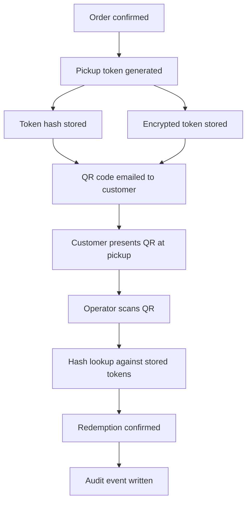

# QR Pickup Pass — Encrypted Token Redemption for Small Business Preorders

I built a secure QR-based pickup verification system for real-world preorder pickup at physical pop ups or small businesses: customers pay online, receive an emailed QR pass, and staff scan it at the market to confirm and redeem the order — with a full audit trail and a self-serve recovery flow for lost passes.

This repository is a sanitized, standalone extraction of that system's pickup-pass subsystem, built for a portfolio review rather than as a running SaaS product. The token, hashing, encryption, and redemption logic are unchanged from production; the surrounding business context (catalog, inventory, other fulfillment methods) has been stripped or mocked out. See [docs/sanitization-notes.md](docs/sanitization-notes.md) for exactly what was removed.

## Problem

Physical pickup for paid online preorders needs a verification step that:

- doesn't require the customer to create an account or remember a password
- can't be guessed, replayed, or forged by someone who didn't pay
- works reliably on a phone screen in bright daylight at a market stand
- gives staff a fast scan-and-confirm flow, with a manual fallback when scanning fails
- leaves an audit trail of who redeemed what, and when

## Solution

Each paid order gets an opaque, high-entropy pickup token. The token itself is emailed to the customer (embedded in a QR code) and is never stored in plaintext server-side — only a SHA-256 hash (for fast lookup) and, optionally, an AES-256-GCM ciphertext (to support recovery re-sends). Staff scan the QR at pickup, the app hashes the scanned value and looks up the matching order, and a database-level redemption function enforces the state transition (paid → issued → redeemed) and writes an audit event.

## Key Features

- Cryptographically random pickup tokens (192 bits of entropy), never derived from or containing the order id
- SHA-256 hash-based lookup — the raw token is the only thing that unlocks a match
- AES-256-GCM encrypted token storage to support "resend my pass" recovery without re-exposing the plaintext token in the database
- QR code generation and emailed delivery, with a public token-keyed pickup page as a link fallback
- Operator redemption panel with camera QR scanning and a manual order-id fallback
- Manual override path for edge cases (damaged QR, scanner failure), separately flagged in the audit trail
- Append-only redemption event log for auditability

## Architecture Overview

The app is a Next.js (App Router) project. Customer-facing routes (`/pickup-pass/[token]`, `/pickup-passes`) are public but only ever addressable via the opaque token or the customer's own email. The operator routes (`/operator/redeem`, `/api/redeem/lookup`, `/api/redeem/confirm`) are meant to sit behind staff authentication in production — see [SECURITY_NOTES.md](SECURITY_NOTES.md) for what's simplified here. See [ARCHITECTURE.md](ARCHITECTURE.md) for the full breakdown.

## Token Lifecycle

See [docs/token-lifecycle.md](docs/token-lifecycle.md) for the complete state machine (issued → active → redeemed / past / invalidated) and the recovery path for lost passes. Short version:

1. On checkout confirmation, a token is generated, hashed, and (if configured) encrypted for storage.
2. The QR code — pointing at the token, not the order id — is emailed to the customer.
3. The customer can also reach their pass by requesting a recovery email, which re-sends any active pass links found for their email address.
4. At pickup, the operator scans the QR or looks up by order id; the app hashes the scanned token and matches it against stored hashes.
5. A single database function enforces valid state transitions and writes the redemption event, so there's one source of truth for "can this be redeemed right now."

## Tech Stack

- **Next.js 15 / React 19** — App Router, server actions, route handlers
- **TypeScript** (strict mode)
- **Node `crypto`** — SHA-256 hashing, AES-256-GCM encryption (no external crypto library)
- **`qrcode`** — QR image generation
- **`html5-qrcode`** (optional) — camera-based scanning in the operator panel
- **Supabase / Postgres** — schema and RPC design shown in `supabase/migrations/`; this showcase runs against in-memory mock data instead of a live database (see [docs/sanitization-notes.md](docs/sanitization-notes.md))
- **Resend** (optional) — transactional email delivery for pass QR codes

## Security Model

Full detail in [SECURITY_NOTES.md](SECURITY_NOTES.md). In short: tokens are opaque and never embedded meaningfully in URLs beyond themselves, lookups are hash-based so a database read alone can't leak a usable token, recovery uses authenticated encryption (AES-256-GCM) rather than reversible-but-weak schemes, and the redemption state transition is enforced in a single database function rather than scattered across application code.

## Demo Strategy

This repo runs against fictional in-memory mock data (`src/lib/mock-data/orders.ts`) rather than a live database, so it's runnable without any infrastructure. The same token/QR/encryption/redemption logic that runs in production runs here — only the persistence layer is swapped. See [docs/demo-flow.md](docs/demo-flow.md) for a walkthrough of the two demo orders and how to exercise the full issue → recover → redeem flow.

## What Was Sanitized for Public Release

- All references to the original business, its production URLs, and real Supabase/Stripe/Resend credentials
- Real customer names, emails, phone numbers, and order ids — replaced with fictional demo data
- The broader preorder catalog/inventory/cycle system that the pickup-pass feature was originally embedded in — this repo keeps only the pickup-pass-relevant schema and code
- Operator authentication/authorization — omitted entirely here; production gates the redemption routes behind staff session auth

Full list in [docs/sanitization-notes.md](docs/sanitization-notes.md).

## What This Demonstrates

- Secure-by-default token design (opaque, hashed, high entropy) applied to a real physical-world redemption problem
- Practical use of authenticated encryption (AES-256-GCM) for a recovery flow, not just as a checkbox
- A database-enforced state machine for a security-sensitive transition (redemption), instead of trusting application code alone
- End-to-end product thinking: this isn't just an API, it's a QR-in-your-inbox-to-scanned-at-a-market-stand flow with a lost-pass recovery path and an audit trail
- Comfortable working across the full stack — schema design, server-side crypto, API routes, and the UI that ties it together

## Future Improvements

- Rate limiting on the recovery-email and lookup endpoints
- Token expiry / rotation policy independent of order state
- Structured operator authentication and role-based access for the redemption panel
- Signed, time-boxed QR payloads as a defense-in-depth layer on top of hash lookup
- Automated tests around the redemption state machine's edge cases (double-redeem races, invalidation-after-issue, etc.)
