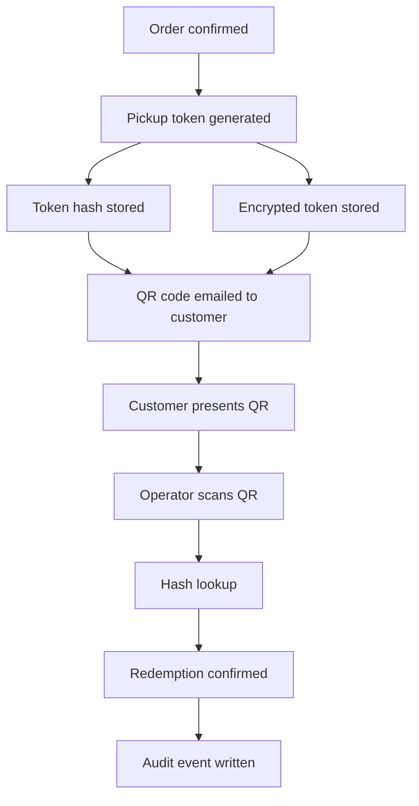

# Token Lifecycle

## Flow

## States

A pickup pass, from the customer's perspective, is always in exactly one of:

- **active** — payment confirmed, token issued, not yet redeemed, pickup date has not passed
- **redeemed** — successfully scanned and confirmed by an operator
- **past** — the pickup window's date has passed without redemption

From the operator's perspective (`redeemState` on a lookup result), an order is one of:

- **pending** — not yet paid, or paid but no token issued yet
- **ready** — paid and issued; eligible for redemption
- **redeemed** — already completed
- **invalid** — canceled, refunded, or explicitly invalidated

## Issuance

1. Order is confirmed and paid.
2. `generatePickupToken()` produces a 192-bit random token, its SHA-256 hash, and its last 4 characters (used for display, e.g. "QR tail: ••••AB12" — enough for a human to eyeball-confirm without exposing the token).
3. `maybeEncryptPickupToken()` produces an AES-256-GCM ciphertext of the raw token, if `PICKUP_TOKEN_ENCRYPTION_SECRET` is configured. If not, recovery/re-send is simply unavailable — the hash-only path (verify, not recover) still works.
4. The hash (and, if present, ciphertext) are stored against the order. The raw token is embedded in a QR code and emailed. The server does not retain the raw token outside of that one email-send operation.

## Redemption

1. Operator scans the QR (or enters the order id manually as a fallback).
2. If scanned: the app hashes the scanned value and looks up the matching stored hash. If found by order id manually, the app still requires either a matching scanned token or an explicit manual override to actually redeem.
3. `confirmOperatorRedeem()` re-checks: order not canceled, payment is paid, a token was issued, not invalidated, not already redeemed, and (absent manual override) the token hash matches.
4. On success: `redeemedAt` is set, fulfillment status flips, and a `redeemed` audit event is written with `{ manual_override: boolean }` in its details.

## Manual override

Scanners fail — cracked phone screens, bad lighting, a QR that didn't render in an email client. The manual override path lets an operator redeem by order id alone, skipping the token-hash check. This is intentionally not a silent equivalent to a normal scan: every manual-override redemption is flagged in its audit event, so it's always possible to distinguish "verified by QR" from "operator judgment call" after the fact.

## Recovery

A customer without their original email (new device, deleted email, etc.) can request a recovery email using the checkout email address alone — no account or password. The system looks up active orders for that email, ensures each has a recoverable (ciphertext-backed) token — reusing an existing recovery token if one was already issued, or minting a new one otherwise — decrypts it, rebuilds the QR, and re-sends. Recovery only ever surfaces *active* passes; a redeemed or invalidated order's pass is not resurrected by this flow.

## Invalidation

An order can be invalidated (e.g. the underlying payment is refunded) independent of redemption. Once `redeemInvalidatedAt` is set, the pass can no longer be redeemed by any path, including manual override. This is the mechanism that keeps a refunded customer from still walking away with the product.
